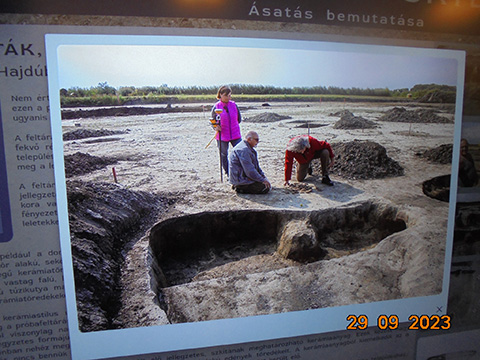

# Hajdúsági Múzeum

## Talpunk alatt történelem

## Időszaki kiállítás

### Multimédia tartalomfejlesztés

#### (Továbbfejlesztés alatt álló projekt)

A Hajdúsági Múzeum az elmúlt tíz évének régészeti tevékenysége során feltárt leleteiből nyitott tárlatot. A tárlat közel 30 ásatási területen, különböző korszakokból számrazó leleteket mutat be. Ehhez készítettem multimédiás tartalomfejlesztést. A projekt web-alapú, flutter-dart rendszerben készült. A Flutter-re  azért esett a választás, hogy később esetleg több platformos teszt-applikáció is születhessen azonos kódbázisból. A fiatalok számára érdekesebb, vonzóbb lehet egy régészeti applikáción keresztül megismerni lakóhelyük sokezer éves múltját.

Az én feladatom volt a grafikai tervezés nagy része (menü ikonok, elrendezés, színek, betűtípusok, aloldalak megjelenése, stb.). Ezeket a grafikai elemeket egyeztetés után igyekeztünk egységesen alkalmazni, és a dart-kódolás segítségvel megjeleníteni. A térképek megjelenítéséhez a Google szolgáltatását használtam fel.

A megjelenítés egy 55"-os érintőmonitoron történik, a tartalomban jól felépített rendszer szerint lehet ugrálni, képeket nézni, nagyítani, térképeket megtekinteni. A kezelés "mobiltelefon jellegű", a tartalmat fel-le lehet húzgálni, a képeket lehet nagyítani.

A projekt tartalmához kapcsolódó játékos feladatok elkészítése még folyamatban van.
A projektből csak néhány file szerepel itt demonstrációs célból, önmagukban nem működőképesek.

<table style="border: 0;">
<tr>
<td></td>
<td></td>
</tr>
<tr>
<td></td>
<td></td>
</tr>
<tr>
<td></td>
<td></td>
</tr>
<tr>
<td></td>
<td></td>
</tr>
</table>

